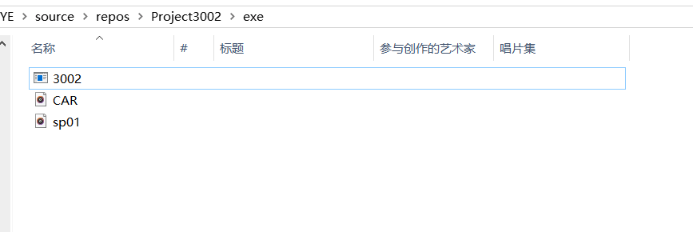

CSC3002
===

# Project Title
# Spectral Analysis and Noisy Speech Enhancement

# Source Code Documentation

**To use the source code documentation, download the folder and click any HTML file under the folder /CodeDoc/html**

# 1. MacOS (Unix)

**1. Clone repositoy to local directory**

**2. Place the exe file and the WAV audio files under the same folder**

**3. Open the terminal at the file folder (use relative path to load the file)**

**4. Choose 3002 on the command line to run the program**

**Or click the program and load the files in absolute path**

# 2. Windows

**1. Clone repositoy to local directory**

**2. Place the exe file and the WAV audio files under the same folder**

**3. Click the 3002.exe to run the program**

# References

**1. Clean speech under the folder *audio/clean***

**https://ecs.utdallas.edu/loizou/speech/noizeus/**

**2. Noisy speech under the folder *audio/noisy speech***

**https://datashare.is.ed.ac.uk/handle/10283/2791?show=full**

**3. Noise audio files under the folder *audio/noise* are provided by supervisor**
